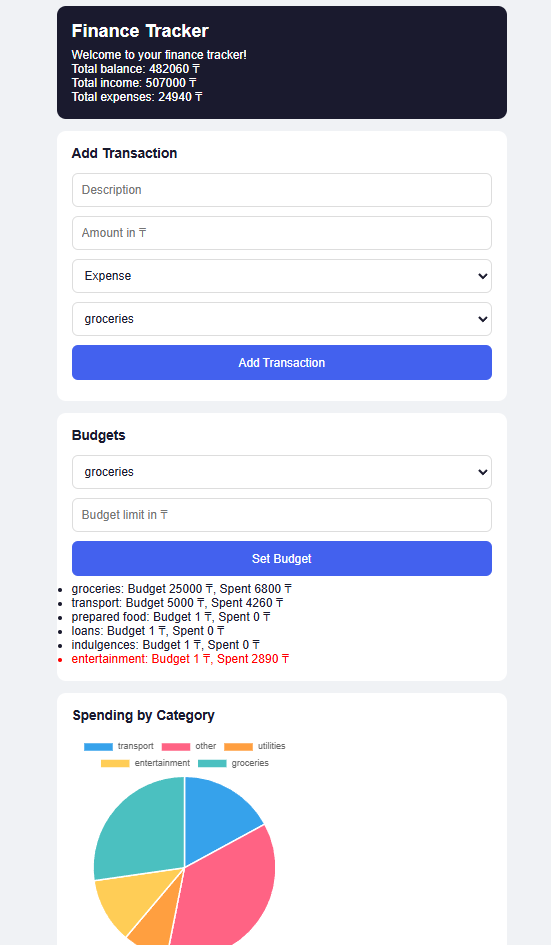

# Finance Tracker

A personal finance web app for tracking income and expenses, built with Node.js, Express, and PostgreSQL. Deployed on Fly.io.



## Features

- **Transaction logging** — record income and expenses with category, amount, and date
- **Monthly view** — see all transactions for the current month; navigate to any previous month
- **Summary dashboard** — total income, total expenses, and running balance calculated automatically
- **Pie charts** — visual breakdown of spending and income by category
- **Budget tracking** — set a budget per category; budget label turns red when expenses exceed it
- **Transaction management** — delete individual transactions or clear all at once
- **User authentication** — session-based login with bcrypt password hashing

## Tech Stack

- **Backend:** Node.js, Express
- **Database:** PostgreSQL (`pg` driver)
- **Auth:** express-session, bcrypt
- **Frontend:** Vanilla HTML/CSS/JavaScript
- **Deployment:** Fly.io (Docker)

## Project Structure

```
├── server/
│   └── index.js        # Express app, all API routes
├── public/
│   ├── index.html      # Main app page
│   ├── login.html      # Login page
│   ├── app.js          # Frontend logic, charts
│   └── style.css       # Styles
├── Dockerfile
├── fly.toml
└── package.json
```

## Getting Started

### Prerequisites

- Node.js 18+
- PostgreSQL running locally

### 1. Clone the repo

```bash
git clone https://github.com/KanaKazak/finance-tracker.git
cd finance-tracker
```

### 2. Install dependencies

```bash
npm install
```

### 3. Set up the database

Create a PostgreSQL database and user:

```sql
CREATE USER finance_user WITH PASSWORD 'your_password';
CREATE DATABASE finance_tracker OWNER finance_user;
```

### 4. Configure environment variables

Create a `.env` file in the root directory:

```env
DB_USER=finance_user
DB_HOST=localhost
DB_NAME=finance_tracker
DB_PASSWORD=your_password
DB_PORT=5432
SESSION_SECRET=your_secret_here
```

### 5. Run the app

```bash
node server/index.js
```

Open [http://localhost:3000](http://localhost:3000) in your browser.

## Deployment

The app is containerized with Docker and deployed to [Fly.io](https://fly.io).

```bash
fly deploy
```

## Live Demo

https://finance-tracker.fly.dev/